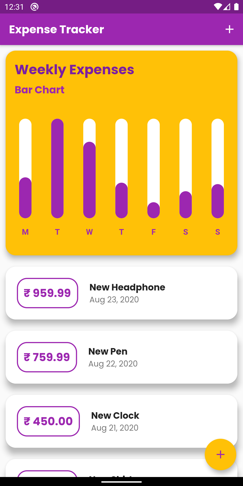
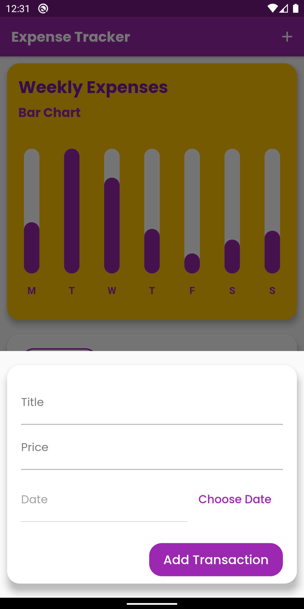
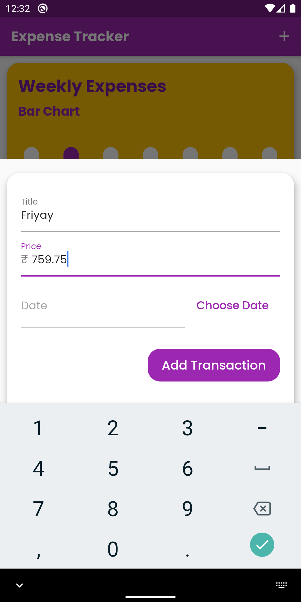
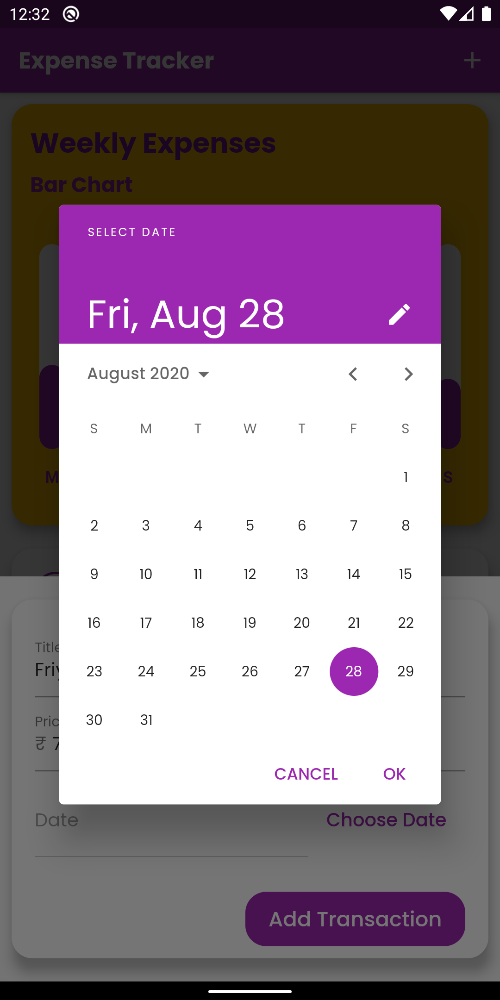
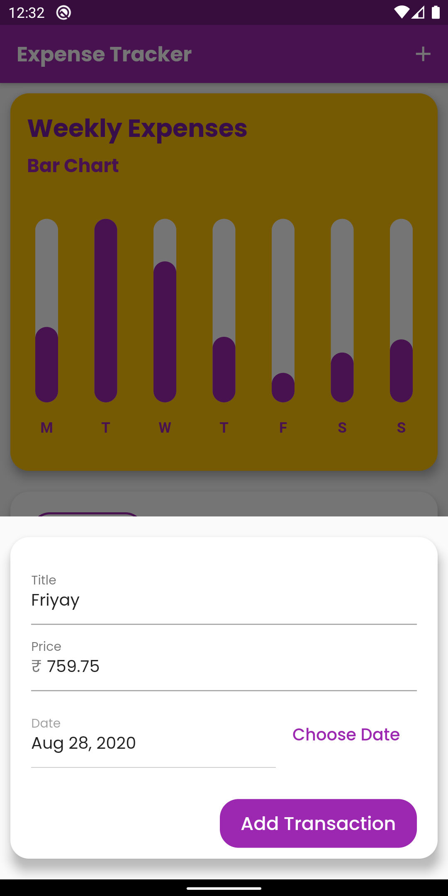
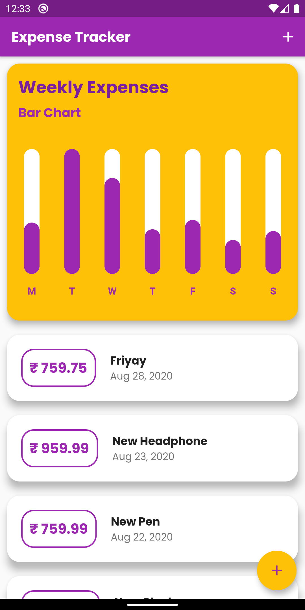
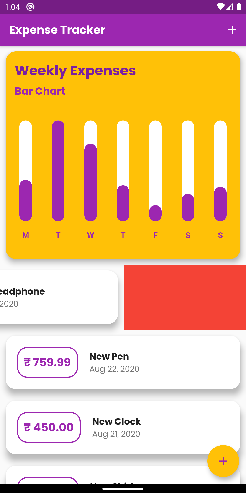
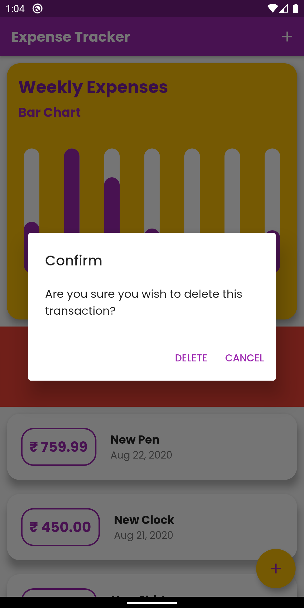

# Expense Tracker

A Flutter App with which you can track your daily expenditures. 
It shows a Real-Time Weekly Bar Graph of the tracked Expenditures.
You can also delete an added expenditure.

# Run The App on Your Android Device Now
Download the APK from here
[Click Here To Go To The Downloads Page](https://github.com/ankanSikdar/flutter-expense-tracker/releases/ "Releases Page")

## Screenshots
       

## Getting Started

This project is a starting point for a Flutter application.

A few resources to get you started if this is your first Flutter project:

- [Lab: Write your first Flutter app](https://flutter.dev/docs/get-started/codelab)
- [Cookbook: Useful Flutter samples](https://flutter.dev/docs/cookbook)

For help getting started with Flutter, view our
[online documentation](https://flutter.dev/docs), which offers tutorials,
samples, guidance on mobile development, and a full API reference.
